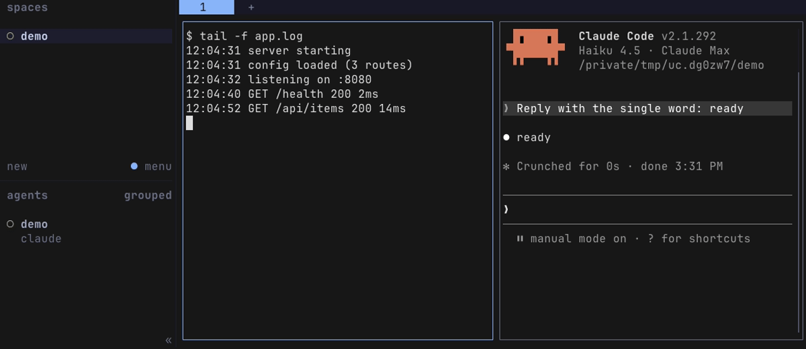

# herdr-undo-close

<p align="center"><strong>Reopen the pane you just closed in Herdr: same split, same scrollback, Claude Code conversation included</strong></p>

<p align="center">
  <a href="LICENSE"></a>
  <a href="https://github.com/federbenjamin/herdr-undo-close/releases/latest"></a>
  <a href=".github/workflows/test.yml"></a>
  <a href="https://github.com/herdrdev/herdr"></a>
</p>

<p align="center"><br><sub>Close with <code>ctrl+d</code>, reopen with <code>prefix+u</code>. Recorded live by <a href="docs/media/hero.sh">hero.sh</a>, no cuts.</sub></p>

A plugin for [Herdr](https://herdr.dev), the terminal multiplexer for running coding agents side
by side. It is undo for a closed pane, like reopening a closed browser tab: close a pane with
`ctrl+d`, press `prefix+u` (`prefix` is Herdr's command key, `ctrl+b` unless you changed it),
and the pane is back in the same split with its old output above a fresh prompt. A Claude Code
pane resumes its conversation. A command that was running comes back typed at the prompt, never
run.

## Install

You need Herdr 0.9+ and `jq`, on macOS or Linux.

```sh
herdr plugin install federbenjamin/herdr-undo-close
```

That is the whole install. After you confirm Herdr's preview, it binds `ctrl+d` and `prefix+u`
in your Herdr config and adds a few lines to the end of the file your pane shell reads at start
(`~/.bash_profile` or `~/.zprofile` on macOS, `~/.bashrc` or `~/.zshrc` on Linux); a reopened
pane needs them to replay its scrollback before the first prompt. Each is one marked block, the
original file is backed up first, and `remove-keys` / `remove-shell` take them out again. A key
you already use is left alone and the install says so; bind `herdr-undo-close.close` and
`herdr-undo-close.reopen` yourself instead. Panes opened after the install have the hook; panes
already open do not.

Then try it: open a new pane, run `echo hi`, press `ctrl+d`, then `prefix+u`. The pane comes
back with `hi` above a fresh prompt.

For a Claude Code pane to resume its conversation, Herdr must know the session: `herdr
integration install claude` once, if you have not already.

Updating is reinstalling. Uninstalling: `herdr plugin action invoke remove-keys --plugin
herdr-undo-close`, the same with `remove-shell`, then `herdr plugin uninstall herdr-undo-close`.

Not working? Read `herdr plugin log list --plugin herdr-undo-close`, then
[open an issue](https://github.com/federbenjamin/herdr-undo-close/issues).

## Features

- **Close as you always have, remembered first.** `ctrl+d` still reaches a shell, a REPL or
  Claude Code, which exit as usual. A pane that would ignore the key, such as a file viewer or
  lazygit, is closed by Herdr. Either way the pane is saved before it goes.
- **`prefix+u` puts it back where it was.** Same split, same side, its old output above a fresh
  prompt. Press it again for the pane closed before that.
- **A Claude Code pane picks up its conversation.** It reopens with `claude --resume` into the
  same session.
- **Your last command comes back typed, not run.** A pane that ran `tail -f app.log` reopens with
  its output and that command waiting at the prompt. Nothing re-executes.
- **Tabs, workspaces and plugin panes too.** Close the last pane of a tab or workspace and
  `prefix+u` brings the tab or workspace back; a plugin pane such as the file viewer reopens as
  the same plugin pane.

## Usage

| key | action | what it does |
| --- | --- | --- |
| `ctrl+d` | `herdr-undo-close.close` | closes the focused pane and remembers it; a popup is just dismissed |
| `prefix+u` | `herdr-undo-close.reopen` | reopens the last closed pane |

| you close | `prefix+u` brings back |
| --- | --- |
| a shell pane | the same split and side, old output above a fresh prompt |
| a Claude Code pane | the same split, old output, then `claude --resume` into that session |
| a Claude Code pane that never got a message | the same split and old output, then a fresh `claude` in that folder, after a dim line saying the session was never saved |
| a pane running `tail -f app.log` | the same split, old output, and `tail -f app.log` typed at the prompt for you to press Enter |
| a plugin pane (the file viewer, an overlay such as clauth) | the same plugin pane, in its old spot: over the pane you are in, or as a split or tab |
| the last pane of a tab or workspace | the tab, or the workspace, with the pane in it |

Press it again for the pane closed before that. The last 20 panes are kept for 7 days; change
that with `keep` and `max_age_days` under [Configuration](#configuration).

What it cannot do: bring back a process. The old `tail -f` is gone; you get its output and its
command line. In vim, less and other programs that take `ctrl+d` themselves, the key does what
it always did there, so that pane is not closed. A pane closed some other way (`exit`, a crash,
Herdr's close-tab key) is not remembered.

## Configuration

Optional. `herdr plugin config-dir herdr-undo-close` prints a directory; create a file there
named `config` with `name=value` lines, shell syntax. [`config.example`](config.example) lists
every setting with its default.

| setting | default | what it does |
| --- | --- | --- |
| `claude_resume_args` | none | flags added to `claude --resume`, e.g. `"--permission-mode auto"` |
| `passthrough_regex` | shells, REPLs, agents, pagers, editors | programs that get `ctrl+d` themselves instead of being closed |
| `keep` | 20 | panes remembered |
| `max_age_days` | 7 | days before a remembered pane is forgotten |
| `agent_minutes` | 10 | minutes after Claude exits during which closing that pane still reopens it as Claude |

Prefer your own keys? Skip `setup-keys` and bind `herdr-undo-close.close` and
`herdr-undo-close.reopen` yourself.

## How it works

- A remembered pane's scrollback is written to disk, readable by you only, under
  `~/.local/state/herdr/plugins/herdr-undo-close/`, until it is reopened, pushed out by `keep`
  newer closes, or `max_age_days` old. Delete the directory any time. Nothing leaves your
  machine.
- A pane that was alone in its tab or workspace reopens as a new tab or workspace in the
  background: you stay where you are. A reopen never moves your focus, because a focus asked
  for by a script would move every attached Herdr window.
- The typed-back command is never run for you, and is not typed at all if it contains a
  control character.
- Closing a popup needs `python3` (optional); without it the key goes to the pane under the popup.
- A plugin pane is recognised through Herdr's `plugin pane focus`, which names its plugin and
  entrypoint; it reopens through `plugin pane open`. A
  [herdr-file-viewer](https://github.com/smarzban/herdr-file-viewer) pane keeps its file: the
  one it showed when the viewer reports it (its `file_viewer_open` pane token; set
  `report_open_file = true` in the viewer's config), else the one it was launched with.
- A Claude Code session that never got a message has no conversation to resume (Claude Code
  saves `<config dir>/projects/<folder>/<session id>.jsonl` only after the first message; the
  config dir is `CLAUDE_CONFIG_DIR`, else `~/.claude`). Such a pane reopens with a fresh `claude`.

## Contributing

Report a bug or ask for a feature in
[the issue tracker](https://github.com/federbenjamin/herdr-undo-close/issues). Report a security
problem privately, as the
[security policy](https://github.com/federbenjamin/.github/blob/main/SECURITY.md) says. Pull
requests are welcome; [CONTRIBUTING](https://github.com/federbenjamin/.github/blob/main/CONTRIBUTING.md)
says how.

Tests are on [bats-core](https://github.com/bats-core/bats-core) and need Herdr 0.9+ and `jq`:

```sh
bats test/unit   # against saved Herdr replies and a fake herdr; no server
bats test/live   # against a real headless Herdr, one server per file
```

They never touch your own Herdr, even when run from inside a Herdr pane. How the isolation
works, re-capturing fixtures and the hero picture, and CI: [docs/testing.md](docs/testing.md).

## License

MIT © Benjamin Feder. See [LICENSE](LICENSE).
