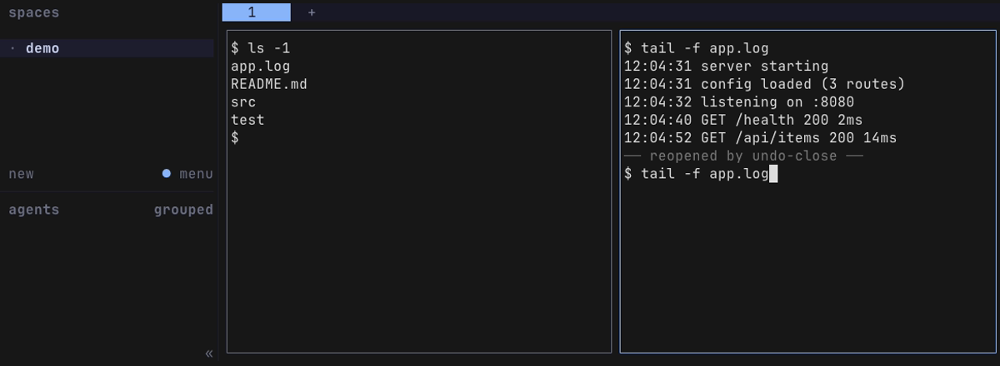

# herdr-undo-close

<p align="center"><strong>Undo close for Herdr panes: ctrl+d closes a pane and remembers it, prefix+u reopens it in its old spot with scrollback</strong></p>

<p align="center">
  <a href="LICENSE"></a>
  <a href="https://github.com/federbenjamin/herdr-undo-close/releases/latest"></a>
  <a href=".github/workflows/test.yml"></a>
  <a href="https://github.com/herdrdev/herdr"></a>
</p>

<p align="center"></p>

A [Herdr](https://herdr.dev) plugin for anyone who has closed a pane and wanted it back. Close a
pane with `ctrl+d`, get it back with `prefix+u`: same spot, same scrollback, and a Claude Code
pane picks up its conversation where it left off.

## Features

- **`ctrl+d` closes anything.** A shell, a REPL, Claude Code, vim or less get the key and exit on
  their own terms; a pane that would ignore it, such as a file viewer or lazygit, is closed by
  Herdr. Either way the pane is remembered first.
- **`prefix+u` brings it back where it was.** Same split, same side, its old output above a fresh
  prompt, and the pane closed before it one press later.
- **A Claude Code pane resumes its conversation.** It reopens with `claude --resume` into the same
  session.
- **A running command comes back typed, not run.** A pane that ran `tail -f app.log` reopens with
  its output and that command waiting at the prompt.
- **Plugin panes, tabs and workspaces come back too.** A file viewer or an overlay reopens as the
  same plugin pane; the last pane of a tab or workspace brings that tab or workspace back with it.

## Install

You need Herdr 0.9+ and `jq`, on macOS or Linux.

```sh
herdr plugin install federbenjamin/herdr-undo-close
herdr plugin action invoke setup-keys --plugin herdr-undo-close
herdr plugin action invoke setup-shell --plugin herdr-undo-close
```

`setup-keys` binds `ctrl+d` to close and `prefix+u` to reopen (`prefix` is Herdr's command key,
`ctrl+b` unless you changed it). `setup-shell` adds a few lines to the end of the file your
pane shell reads at start (`~/.bash_profile` or `~/.zprofile` on macOS, `~/.bashrc` or
`~/.zshrc` on Linux); a reopened pane needs them to replay its scrollback before the first
prompt. Both write one marked block, keep a backup of the original file, and have a
`remove-keys` / `remove-shell` twin. A key you already use is left alone.

An action reports through a Herdr notification and `herdr plugin log list --plugin
herdr-undo-close`; `invoke` itself prints only that it started.

For Claude Code resume, Herdr must know the session: `herdr integration install claude` once.

Updating is reinstalling. Uninstalling: run `remove-keys` and `remove-shell` first, then
`herdr plugin uninstall herdr-undo-close`.

## Usage

| key | action | what it does |
| --- | --- | --- |
| `ctrl+d` | `herdr-undo-close.close` | closes the focused pane and remembers it; a popup is just dismissed |
| `prefix+u` | `herdr-undo-close.reopen` | reopens the last closed pane |

What `prefix+u` brings back:

```
close a shell pane        →  same split, same side, old output above a fresh prompt
close a Claude Code pane  →  same split, old output, then `claude --resume` into that session
close a Claude Code pane  →  same split, old output, then a fresh claude in that folder, with a
  that never got a message   note
close a pane running      →  same split, old output, and `tail -f app.log` typed at the
  `tail -f app.log`          prompt for you to press Enter
close a plugin pane       →  the same plugin pane: an overlay over the pane you are in, a split
  (file viewer, clauth)      or tab back in its spot
close the last pane of    →  the tab, or the workspace, comes back with it
  a tab or workspace
```

Press it again for the pane closed before that. How many are kept, and for how long: `keep` and `max_age_days` under Configuration.

What it cannot do: bring back a process. The old `tail -f` is gone; you get its output and its
command line. A pane closed some other way (`exit`, a crash, Herdr's close-tab key) is not
remembered.

## Configuration

Optional. Copy a line from `config.example` into the file `herdr plugin config-dir
herdr-undo-close` points at, named `config`, and change it. It is sourced as shell.

| setting | default | |
| --- | --- | --- |
| `claude_resume_args` | none | flags for `claude --resume`, e.g. `"--permission-mode auto"` |
| `passthrough_regex` | shells, REPLs, agents, pagers, editors | programs that get `ctrl+d` instead of being closed |
| `keep` | 20 | panes remembered |
| `max_age_days` | 7 | days before a remembered pane is forgotten |
| `agent_minutes` | 10 | how long after Claude exits a close of that pane still reopens as Claude |

Prefer your own keys? Skip `setup-keys` and bind `herdr-undo-close.close` and
`herdr-undo-close.reopen` yourself.

## How it works

- A remembered pane's scrollback is written to disk, readable by you only, under
  `~/.local/state/herdr/plugins/herdr-undo-close/`, until it is reopened, pushed out by `keep`
  newer closes, or `max_age_days` old. Delete the directory any time.
- A pane that was alone in its tab or workspace reopens as a new tab or workspace in the
  background: you stay where you are. A focus that a script asks Herdr for moves every attached
  Herdr window, so a reopen never takes one.
- The typed-back command is never run for you, and is not typed at all if it contains a
  control character.
- Closing a popup needs `python3`; without it the key goes to the pane under the popup.
- A plugin pane is recognised through Herdr's `plugin pane focus`, which names its plugin and
  entrypoint; it reopens through `plugin pane open`. A
  [herdr-file-viewer](https://github.com/smarzban/herdr-file-viewer) pane keeps its file: the
  one it showed when the viewer reports it (its `file_viewer_open` pane token; set
  `report_open_file = true` in the viewer's config), else the one it was launched with.
- A Claude Code session that never got a message has no conversation to resume (Claude Code
  saves `<config dir>/projects/<folder>/<session id>.jsonl` only after the first message; the
  config dir is `CLAUDE_CONFIG_DIR`, else `~/.claude`). Such a pane reopens with a fresh `claude`.

## Contributing

Report a bug or ask for a feature in
[the issue tracker](https://github.com/federbenjamin/herdr-undo-close/issues). Report a security
problem privately, as the
[security policy](https://github.com/federbenjamin/.github/blob/main/SECURITY.md) says. Pull
requests are welcome; [CONTRIBUTING](https://github.com/federbenjamin/.github/blob/main/CONTRIBUTING.md)
says how.

Two test layers, on [bats-core](https://github.com/bats-core/bats-core). You need Herdr 0.9+,
`jq` and bats-core; the zsh case is skipped when `zsh` is not installed.

```sh
bats test/unit   # entry.jq, close.sh, remember.sh, reopen.sh, reopen_entry.sh, setup.sh and the live harness's own checks, against saved Herdr replies and a fake herdr; no server
bats test/live   # close.sh and reopen.sh against a real headless Herdr, one server per file
```

The tests never touch your own Herdr, even when run from inside a Herdr pane. Each unit test,
and each live file (its tests share one server), gets a temporary HOME under `/tmp`, with every
`HERDR_*` and `XDG_*` variable removed, and every Herdr call, the plugin's included, goes
through `test/helpers/herdr-guard`, which refuses any call that could reach a server outside
that HOME. A refused call fails the unit test that made it, or, in a live file, the file's
teardown. The one call that skips Herdr, `close.sh`'s popup check, needs `HERDR_SOCKET_PATH`,
which the tests remove, so it makes no connection.

`test/fixtures/capture.sh` re-captures the saved replies from an isolated server, for a new
Herdr version. `docs/media/hero.sh` re-takes the picture above the same way (it needs `vhs`). CI
(`.github/workflows/test.yml`) runs shellcheck and both layers on Ubuntu and macOS.

## License

MIT © Benjamin Feder. See [LICENSE](LICENSE).
